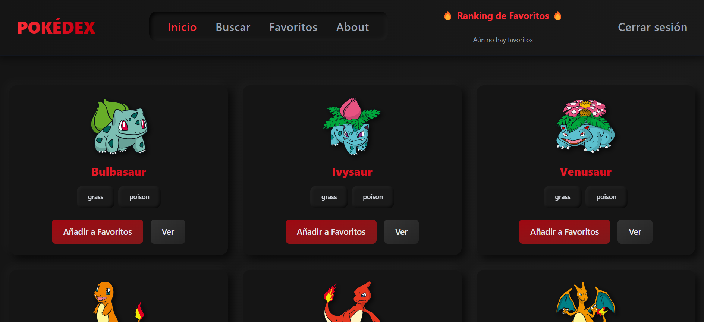
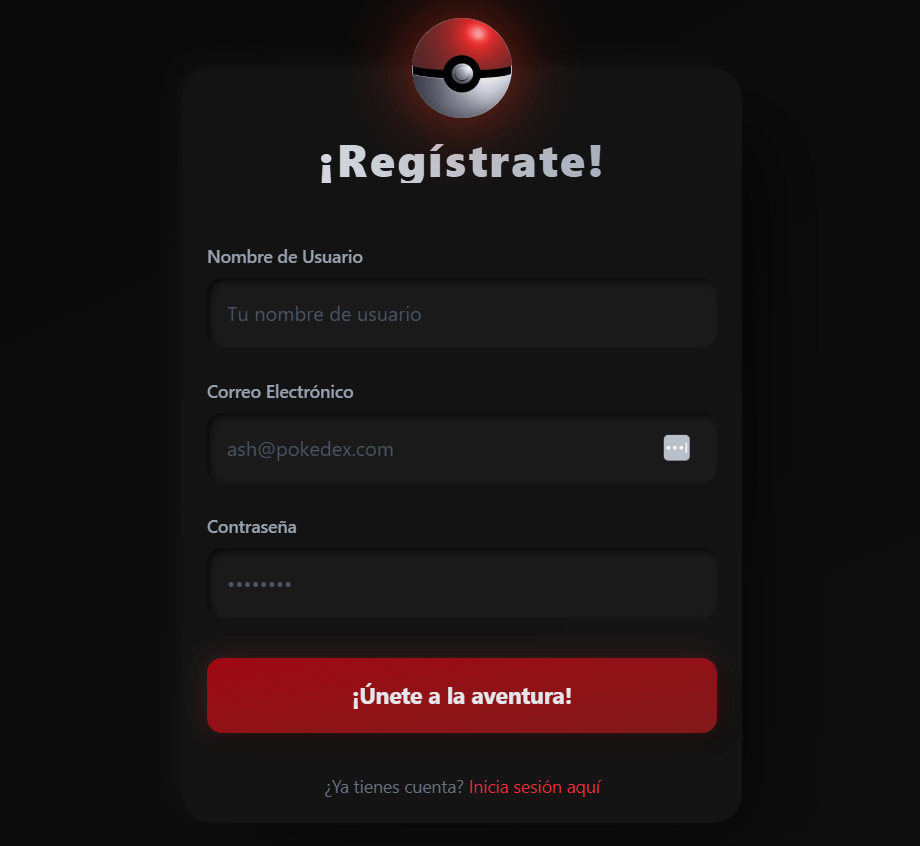
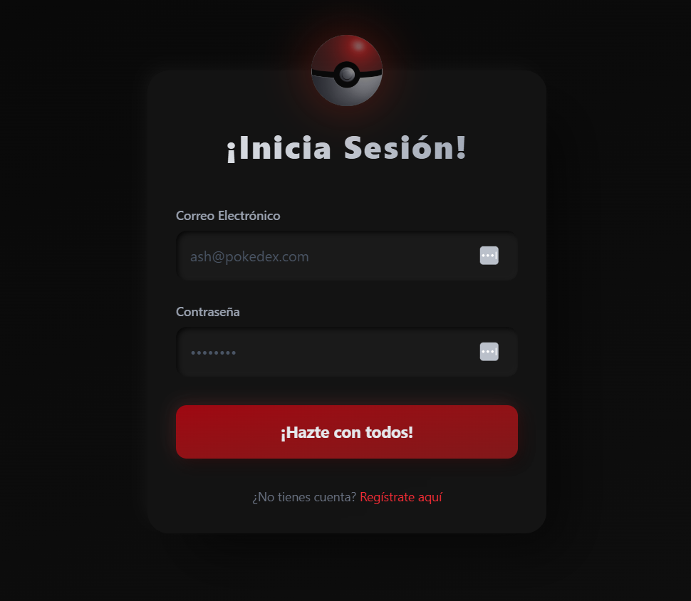
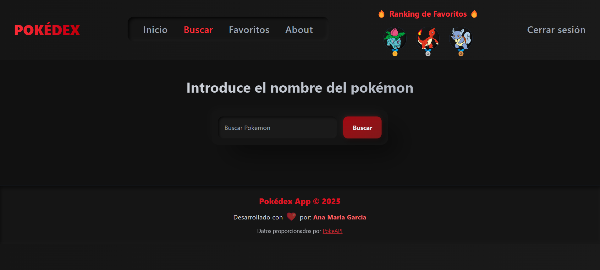
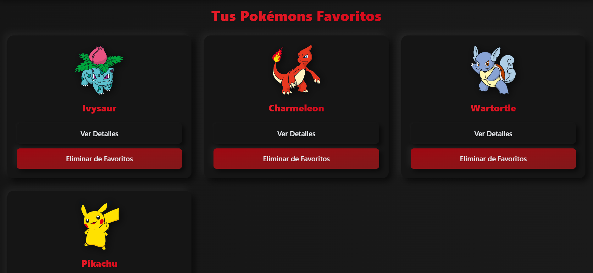
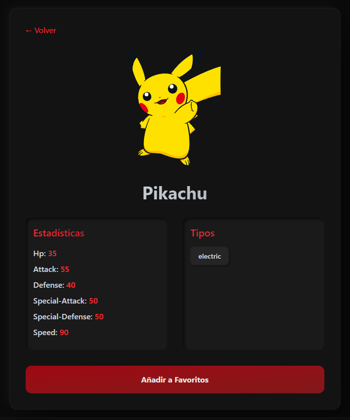
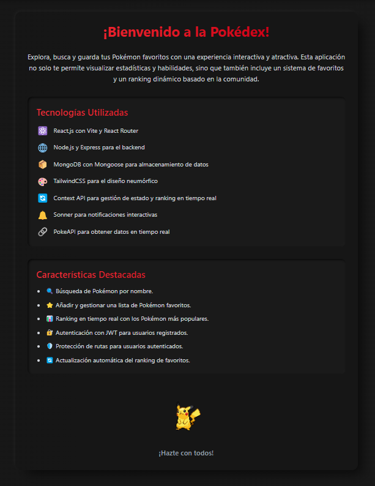

# Interfaz de Usuario - Pokédex

## Introducción
Esta guía proporciona una visión general de la interfaz de usuario de la aplicación Pokédex. Se incluirán capturas de pantalla para ilustrar cada sección y facilitar la comprensión de la funcionalidad de la plataforma.

---

## 1. Pantalla de Inicio

La pantalla principal de la Pokédex muestra una lista de Pokémon disponibles. Desde aquí, los usuarios pueden ver detalles y agregar Pokémon a sus favoritos.

Funciones principales:
- Navegación entre diferentes secciones.
- Agregar Pokémon a favoritos.

---

## 2. Barra de Navegación

La barra de navegación permite acceder rápidamente a diferentes secciones como Inicio, Buscar, Favoritos, Acerca de y ver el ranking.

Funciones principales:
- Acceso directo a las secciones clave de la app.
- Visualización del ranking de favoritos.
- Cierre de sesión.

---

## 3. Registro e Inicio de Sesión

Los usuarios pueden registrarse o iniciar sesión en la plataforma para personalizar su experiencia.

### Registro:

### Inicio de Sesión:

Funciones principales:
- Crear una nueva cuenta.
- Acceder a una cuenta existente.

---

## 4. Búsqueda de Pokémon

La sección de búsqueda permite a los usuarios encontrar Pokémon específicos escribiendo su nombre.

Funciones principales:
- Campo de entrada para buscar Pokémon.

---

## 5. Sección de Favoritos

Los usuarios pueden ver y gestionar sus Pokémon favoritos en esta sección.

Funciones principales:
- Ver Pokémon guardados como favoritos.
- Acceder a los detalles de cada Pokémon.
- Eliminar Pokémon de la lista de favoritos.

---

## 6. Detalles de un Pokémon

Al seleccionar un Pokémon, se accede a una pantalla con su información detallada.

Funciones principales:
- Mostrar estadísticas y tipo del Pokémon.
- Agregar o eliminar de favoritos.

---

## 7. Sección "Acerca de"

Brinda información sobre la aplicación y las tecnologías utilizadas.

Funciones principales:
- Información sobre la app y su desarrollo.
- Lista de tecnologías utilizadas.
- Características destacadas de la aplicación.

